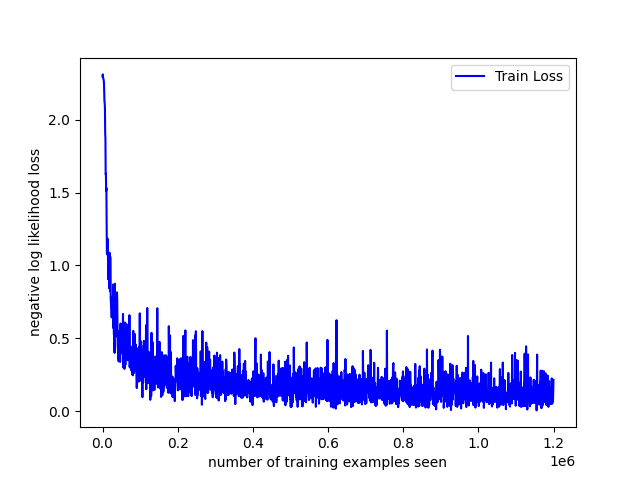
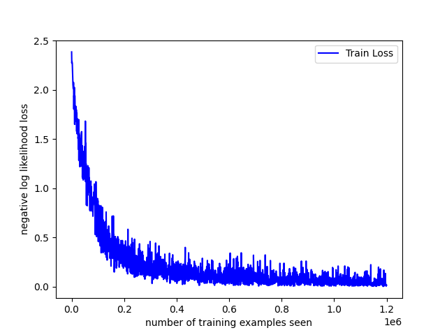

# 基于 Mnist 数据集的手写数字识别

## 1. 项目简介

本项目是基于 Mnist 数据集的手写数字识别，使用了深度学习和机器学习方法，通过搭建卷积神经网络模型，对手写数字进行识别。项目使用 Python 语言，主要使用了 PyTorch 框架，通过对 Mnist 数据集的训练，实现了对手写数字的识别。

## 2. 项目结构

本项目的目录结构如下：

```
Digit-recognition/
│
├── ../../Dataset/                   # 数据集
│   ├── mnist/              # Mnist数据集
│
├── model/                  # 模型
│   ├── net.py        # 深度学习模型
│
├── utils/                  # 工具
│   ├── data_loader.py      # 数据加载
│
├── caches/                 # 模型权重文件
│
├── demo.py                 # 深度学习方法
├── ml.py                   # 机器学习方法
├── README.md               # 项目说明
```

## 3. 模型结构

本项目实现了 3 种机器学习方法和 3 种深度学习方法，分别是：

- 机器学习方法：
  - KNN
  - SVM
  - Random Forest
- 深度学习方法：
  - Vanilla CNN
  - Residual CNN
  - Vision Transformer

## 4. 数据集

本项目使用了 Mnist 数据集，Mnist 数据集是一个手写数字数据集，包含了 60000 个训练样本和 10000 个测试样本。每个样本是一个 28\*28 的灰度图像，图像中包含了 0-9 的手写数字。Mnist 数据集是深度学习领域中常用的数据集之一，本项目使用 Mnist 数据集进行训练，实现了对手写数字的识别。

### 4.1 数据预处理

在训练模型之前，需要对数据进行预处理，主要包括数据加载、数据预处理、数据增强等步骤。本项目使用 PyyTorch 框架自带的数据加载模块，对 Mnist 数据集进行加载，并进行了数据预处理，包括数据归一化、数据增强等操作。

```python
def LoadData(path, batch_size_train, batch_size_test):
    train_loader = torch.utils.data.DataLoader(
        torchvision.datasets.MNIST(path, train=True, download=True,
                                transform=torchvision.transforms.Compose([
                                    torchvision.transforms.ToTensor(),
                                    torchvision.transforms.Normalize(
                                        (0.1307,), (0.3081,))
                                ])),
        batch_size=batch_size_train, shuffle=True)
    test_loader = torch.utils.data.DataLoader(
        torchvision.datasets.MNIST(path, train=False, download=True,
                                transform=torchvision.transforms.Compose([
                                    torchvision.transforms.ToTensor(),
                                    torchvision.transforms.Normalize(
                                        (0.1307,), (0.3081,))
                                ])),
        batch_size=batch_size_test, shuffle=True)

    return train_loader, test_loader
```

## 5. 使用说明

### 5.1 环境要求

- Python 3.x
- PyTorch
- Numpy
- Matplotlib
- sklearn

### 5.2 运行步骤

5.2.1 机器学习方法

(a) 训练

```
python ml.py --method=[METHOD] --save_path='/caches/' --train=True
```

(b) 测试

```
python ml.py --method=[METHOD] --save_path='/caches/' --train=False
```

[METHOD] 可选值：['svm', 'knn', 'random_forest']

5.2.2 深度学习方法

(a) 训练

```
python demo.py --method=[METHOD] --save_path='/caches/' --train=True --epochs=10
```

Vanilla CNN, Residual CNN, Vision Transformer 的训练日志：

<center>
<figure>
 


</figure>
</center>

(b) 测试

```
python demo.py --method=[METHOD] --save_path='/caches/' --train=False
```

[METHOD] 可选值：['vanilla_cnn', 'residual_cnn', 'transformer']

## 6. 量化评估

本项目对比了 3 种机器学习方法 (SVM, KNN, Random Forest) 和 3 种深度学习方法 (Vanilla CNN, Residual CNN, Vision Transformer) 的性能，通过对 Mnist 数据集的训练和测试，计算了模型的准确率, 评估了模型的性能。通过对比不同方法的性能，可以了解不同方法的优劣，选择合适的方法进行手写数字识别。 下表为不同方法的性能对比：

| 方法               | 准确率 | 收敛轮数 |
| ------------------ | ------ | -------- |
| SVM                | 0.9426 | -        |
| KNN                | 0.9759 | -        |
| Random Forest      | 0.9722 | -        |
| Vanilla CNN        | 0.9840 | 2        |
| Residual CNN       | 0.9930 | 2        |
| Vision Transformer | 0.9741 | 15       |
